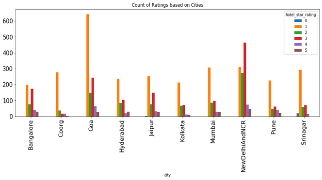
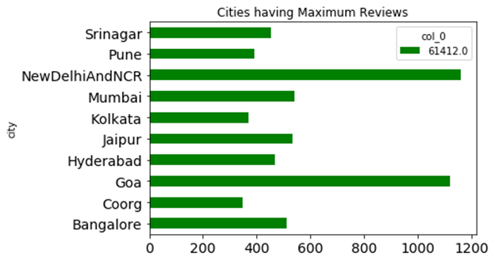

# HOTEL RECOMMENDATION SYSTEM - MAKEMYTRIP DATASET(Scraped from the website www.makemytrip.com) 
 
## 1.	Data Exploration and data visualization

### Data Exploration

•	The dataset has 20,000 records with 33 features which include details about hotel like city, Property type, Hotel-star rating, makemytrip website details and so on.

•	While creating a recommendation system we try to predict the Hotel star rating which is already given in the dataset. Hence this is a supervised problem due to the limited availability of data. 

•	We use rest of the features given in the data set to build a prediction model that predicts the Hotel-star rating(that varies between 0-5) and check the accuracy of the model by using a fraction of the dataset not used in training to get the test accuracy.

•	To get more accurate results we carry out cross validation with 5 folds, this helps us to train the model with the entire dataset that we have.

•	To get more accurate results we carry out cross validation with 5 folds, this helps us to train the model with the entire dataset that we have.

### Data visualization

•	We try to visualize the Top 10 cities Hotel-star rating distribution

•	We also visualize the Top 10 Cities Review counts

## 2.	Data pre-processing

•	After initial data exploration there were few concerns and steps that were taken as explained in the following points. Firstly, we had lots of missing data which had to be dealt with (review count, review score, etc.), irrelevant data (like crawl date), data that was same throughout the data set and did not vary (like sitename and country).

•	So, to deal with Missing data there were two steps that were taken:

(a)	If the missing data was more than 50% then that feature was dropped.

(b)	Otherwise, we imputed the missing values by using the data mean for continuous variable and the most frequent category in categorical variables.

•	The irrelevant columns/ features and constant data were directly dropped.

•	Another concern addressed was creating a uniform data like converting cities names like ‘New Delhi & NCR’ and ‘NewDelhi&NCR’ into the same category and so on.

•	Also imputed Latitude, longitude values which were zero as we know India cannot have latitude, longitude values as zero. We replace the zeros with average latitude and longitude value of that city were the latitude, longitude values were zero.

•	All the relevant data is then converted to a numerical format for the model analysis using Label encoder from scikit learn library.

## 3.	Model Fitting (Hyper parameter Tuning carried out to find the best parameters)

•	Baseline model – Logistic model was used as the baseline model for classification problem. This model gives a test accuracy of 62%.

•	Random forest Classifier – This method of prediction gives a test accuracy of 72%.

•	Gradient Boosting – This method of prediction gives a test accuracy of 73%.

•	Support vector machine – This method of prediction gives a test accuracy of 63.5%.

## 4.	Conclusion

•	We can say that the Decision tree models work well as we have a significant amount of categorical data in our input.

•	The baseline model Logistic regression and SVM didn’t work that great as we understand that the data set is highly imbalanced and needs much more sophisticated methods to do a better job at classification.

## 5.	Further work

•	We could use more sophisticated methods to impute the missing data for columns like in_your_room and highlight_value.

•	We could also use text analysis on the hotel_overview column to extract useful information and achieve a higher test accuracy.

### NOTE – Since this is a general recommendation system, we used predictive modeling directly, however, when we have user based recommendation systems the best method possible to create them is collaborative filtering. This kind of model basically tries to find the similarity between different users and recommends new products or information based on their similarity to other customers. So in our example, we can use nearest neighbor algorithms to compute the similarity and recommend the best hotels to any customer.
